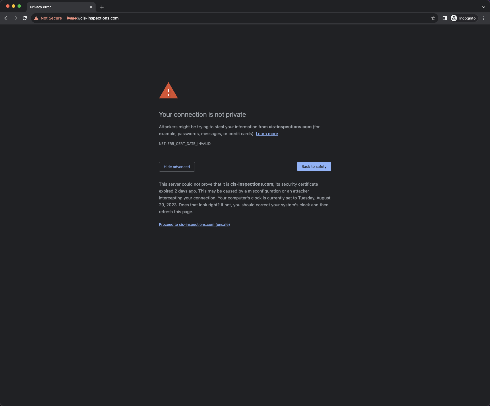
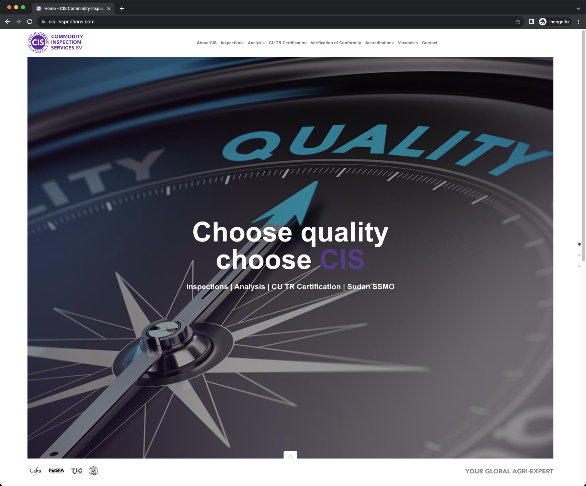

# cis-inspections.com reverse proxy

:fast_forward: Skip to [Getting Started](#getting-started)

# Table of Contents

<!-- toc -->

- [Problem](#problem)
- [Solution](#solution)
- [Project Overview](#project-overview)
- [Getting Started](#getting-started)
- [Environment Variables](#environment-variables)
- [Considerations](#considerations)

<!-- tocstop -->

## Problem

The SSL certificate for [cis-inspections.com][1] has expired. We recently transfered the DNS nameservers from the
hosting provider for [cis-inspections.com][1] to one of our own DNS providers. Due to this, the hosting provider
for [cis-inspections.com][1] has denied renewal of the SSL certificate. The impact is that [cis-inspections.com][1]
is now _"innaccessible"_; all users visiting [cis-inspections.com][1] in a web browser will be met with a privacy error.

## Solution

Until we migrate [cis-inspections.com][1] off of its current platform / hosting provider and onto other infrastructure,
there is a feasible solution to bring the site "back online":

Configure a reverse proxy, such as `nginx`, ignoring SSL certificate verification of the proxied server.

At a high level:

1. Obtain new SSL certificates via DNS-based verification 
2. Deploy this reverse proxy app to our server(s)
3. Update the DNS records for `cis-inspections.com` and `www.cis-inspections.com` to point to our new reverse proxy

## Project Overview

This project utilizes Docker / Docker Compose to achieve our [solution](#solution). It has currently been tested to solve our
[problem](#problem) in a _local_ environment. You may choose to use a separate container orchestration solution,
such as Kubernetes, or a managed container orchestration solution, such as Amazon ECS / EKS when deploying
this app to production.

The `docker-compose.yml` file contains all of our declarative orchestration configuration.

This project defines 1 service: `nginx`. It does all that we need to achieve our [solution](#solution).  
All of the files you will find in `.docker/nginx/` are specifically intended to configure our `nginx`
image/container as needed.

- `.docker/nginx/conf/conf.d/` - Files that will end up in `/etc/nginx/conf.d/` within the container, after being
processed with `envsubst`. Ref: https://hub.docker.com/_/nginx#:~:text=Using%20environment%20variables
- `.docker/nginx/conf/entrypoint.d/` - Scripts that will be executed during the base image's default entrypoint.
We currently have a `10-nginx.conf.sh` file here whose purpose is to set our own custom `/etc/nginx/nginx.conf`
configuration file within the container. The reason this is necessary is because we are using environment
variable interpolation here, which is not possible otherwise.

## Getting Started

1. `cp .env.template .env`
2. Read documentation on [Environment Variables](#environment-variables), which covers environment variables defined in `.env`
   * Update any environment variables in `.env` as needed
3. `mkdir -p ./.docker/nginx/conf/ssl/{certs,private}`
4. Place a _trusted_ SSL certificate in PEM format in `./.docker/nginx/conf/ssl/certs/`
5. Place the corresponding SSL certificate private key in PEM format in `./.docker/nginx/conf/ssl/private/`
6. `docker compose build`
7. `docker compose up -d`

## Environment Variables

- **FQDN** - The fully qualified domain name of the host where this reverse proxy will be deployed.  
Defaults to `cis-inspections.com`.
- **LOCAL_HTTPS_PORT** - The local port to map to the HTTPS port within the `nginx` container.  
Defaults to `443`.
- **NGINX_ENTRYPOINT_QUIET_LOGS** - When set to `1`, reduces verbosity of `nginx` container logs during entrypoint.  
Ref: https://hub.docker.com/_/nginx#:~:text=Entrypoint%20quiet%20logs  
Defaults to `1`.
- **PROXY_HOST** - The hostname or IP of the host that will be proxied by `nginx`.  
Defaults to `145.131.16.87` (The IP of `cis-inspections.com`).
- **PROXY_SSL_VERIFY** - Whether or not to enable SSL certificate verification of the proxied server.  
Defaults to `off` (Because the origin server for `cis-inspections.com` has an expired SSL certificate).

## Considerations

This project is not complete. For example:

- The `nginx` configuration does not currently implement `X-Forwarded-*`
HTTP headers. If the origin server requires real client IPs in any way, both the proxy server and origin server
will require updates.
- The `nginx` configuration currently only supports a single `FQDN` for its `server_name`.
It would be necessary to allow adding `www.cis-inspections.com` to its `server_name` list
to fully solve our [problem](#problem).

[1]: https://cis-inspections.com/
